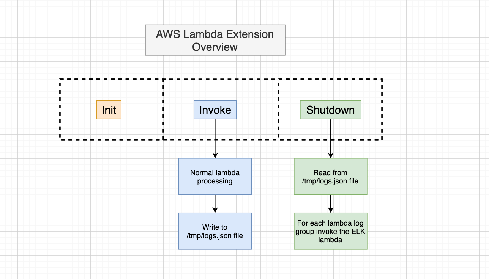
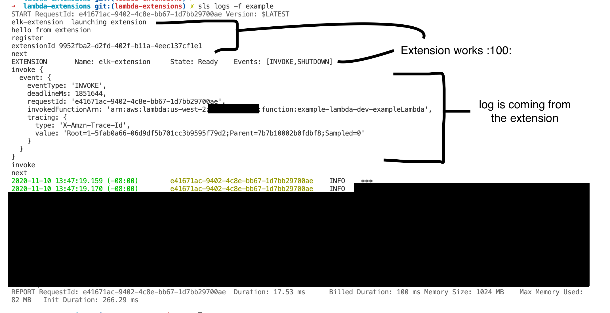
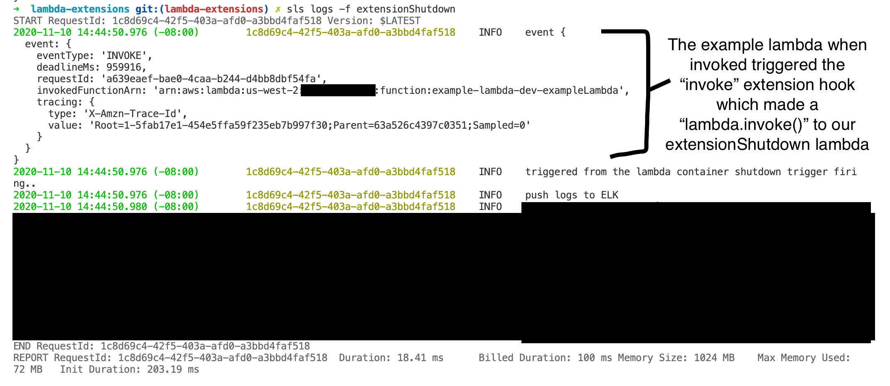

# ELK Lambda Extension

## NOTE: Pattern is setup with Serverless Pro for deployments

```yaml
# Remove these lines from serverless.yml to not use Serverless Pro
org: ...
app: ...
```

## Purpose

Create a lambda extension pattern that works with NodeJS12.x which will run code when the "shutdown" hook is triggerd.



## Template Overview

* `layers`
    * `elk` - elk extension layer
        * `elk-extension` - nodejs code to do something when the hook is triggered
            * `extensions-api.js` - handles **register** and **next**
            * `index.js` - handles registering the extension and business logic for **EventType.SHUTDOWN** and **EventType.INVOKE**
        * `extensions` - executable that starts the process
        * `serverless.yml` - defines IAC for creating the lambda extension layer
* `serverless.yml` - defines a sample lambda which will have the ELK extension layer attached

### Lambda functions

Example Lambda - connected to ELK Lambda extension should emulate a real lambda which needs to push logs to ELK

```yaml
# Lambda that has ELK Extension attached
example:
    name: ${self:custom.base}-exampleLambda
    handler: index.handler
    events:
        - http:
            path: /example
            cors: true
            method: any
    layers:
        - ${output:${self:custom.layerStackName}.ELKLambdaExtensionLayerArn}
```

Extension Shutdown Lambda - will be triggered when **EventType.SHUTDOWN** is triggered

```yaml
# Lambda to test Extension Shutdown
extensionShutdown:
    name: ${self:custom.base}-extension-shutdown
    handler: index.handler
    events:
        - http:
            path: /extensionShutdown
            cors: true
            method: any
```

## ELK Lambda Extension Layer Setup

Setup the `index.js` permissions.

```bash
$ cd layers/elk/elk-extension
$ chmod +x index.js
$ npm install
$ cd ../../../
```

Setup the `extensions` executable file which will call our NodeJS `index.js` file

```bash
$ cd layers/elk/extensions                 
$ chmod 755 elk-extension
```

### Deploy

**Login to Serverless Pro:**

```bash
$ sls login
```

**Deploy:**

```bash
$ cd layers/
$ sls deploy --stage dev --region us-west-2 -v
$ cd ../
```

## Sample Lambda

```bash
$ sls deploy --stage dev --region us-west-2 -v 
```

## Testing

**Local**

```bash
$ sls invoke local -f example -d '{"headers":{"x-amzn-trace-id": "1234abcd"}}'
```

**Real Lambda**

```bash
$ sls invoke -f example -d '{"headers":{"x-amzn-trace-id": "1234abcd"}}'
```

**Get Logs from Real Lambda**

You can also trail logs by adding `-t` to the end, otherwise the command below will get the last log.

```bash
$ sls logs -f example
```

**Extension Working - Basic Registering**

This screenshot shows our example Lambda function being invoked and the Lambda extension attached via an AWS Lambda Layer logging.



**Extension Working - Lambda Extension Invoke Trigger**

This screenshot shows our Lambda Extension Invoke Trigger doing a `lambda.invoke()` to our extensionShutdown lambda for emulating our ELK lambda in the future.




## Errors that you may face

```bash
$ sls invoke -f example -d '{"headers":{"x-amzn-trace-id": "1234abcd"}}' 
{
    "errorMessage": "RequestId: e7977454-f1e5-4970-ad0f-7da70665f51d Error: fork/exec /opt/extensions/elk-extension: permission denied",
    "errorType": "Extension.LaunchError"
}
```

**To fix this:**

```bash
$ cd layers/elk/extensions                 
$ chmod 755 elk-extension
```

#### References

* [Lambda Runtime Extensions API](https://docs.aws.amazon.com/lambda/latest/dg/runtimes-extensions-api.html)
* [Building Extension for Lambda](https://aws.amazon.com/blogs/compute/building-extensions-for-aws-lambda-in-preview/)
* [Example Extension in NodeJS](https://github.com/aws-samples/aws-lambda-extensions/tree/main/nodejs-example-extension)