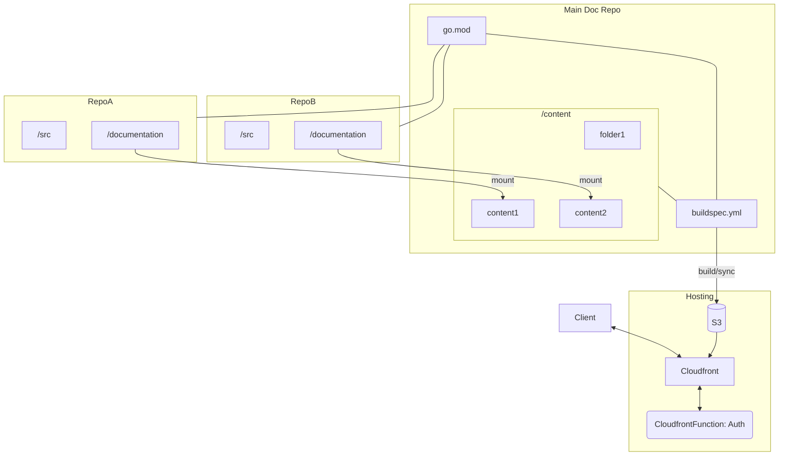

# Centralized Documentation for Multi-Repository project
When working on a project composed of multiples repositories, you want a single place for your documentation. But you still want to update the documentation relative to a repository in the repository itself.

By using [goHugo](https://gohugo.io), a static site generator, we can achieve this.

By _mounting_ an external repo's `documentation` folder, we can render a static site including all pages from a the other repo.




Examples for all different pieces are present as subfolders here. In reality they would be different repositories.

## [Hosting](hosting)
A [serverless.com](https://serverless.com) project providing:
* S3 Bucket with _website_ enabled to host the files

  The website configuration is needed to serve _index.html_ files. Since OAI can't be used in this case, a basic header based policy protects the direct access to S3.
* Cloudfront Distribution
* Cloudfront Function to protect access behind a _Basic Authentication_

  The _Basic Authentication_ serves only as an example and shouldn't be used. If you want to put your documentation behind a login wall, you would need to consider oAuth or other better suited alternatives.

## [Main site](mainRepo)
A [gohugo](https://gohugo.io) site. Some basic example is shown in the subfolder.

The theme used is [geekdocs](https://geekdocs.de/), but any theme can be used instead. Even the theme could be mounted.

It is possible to mix content provided by _mainRepo_ and from remote repos.

External content is integrated using _ mounts_, configured in _config.toml_ under `module.imports.mounts`.

### Build
The modules need to be updated before we can build the site.

```bash
hugo mod get -u
hugo
```

### Deploy
We set _max-age_ to 1 hour to force the browser revalidate the content. This is mainly useful to force revalidate any oAuth token. Set this time to the same amount as you token's validity.

We set s-maxage to 1 year. This allows the file to stay longer in Cloudfront and would need a refresh from the backend as often.

After each deploy we also invalidate the cache.

```bash
aws s3 sync --cache-control --delete "public, max-age=3600, s-maxage=31536000" public/ s3://doc.example.com/
aws cloudfront create-invalidation --distribution-id $(aws cloudfront list-distributions --output text --query 'DistributionList.Items[?Aliases.Items[0]==`doc.example.com`].Id') --paths "/*"
```

## [RepoA](repoA)
Some sample application. The important piece is the _ documentation_ folder.

The structure of the documentation folder follows the structure of a sub-folder in the main site's _ content_ folder.

## [RepoB](repoB)
Some other sample application. The important piece is the _ documentation_ folder.

The structure of the documentation folder follows the structure of a sub-folder in the main site's _ content_ folder.
