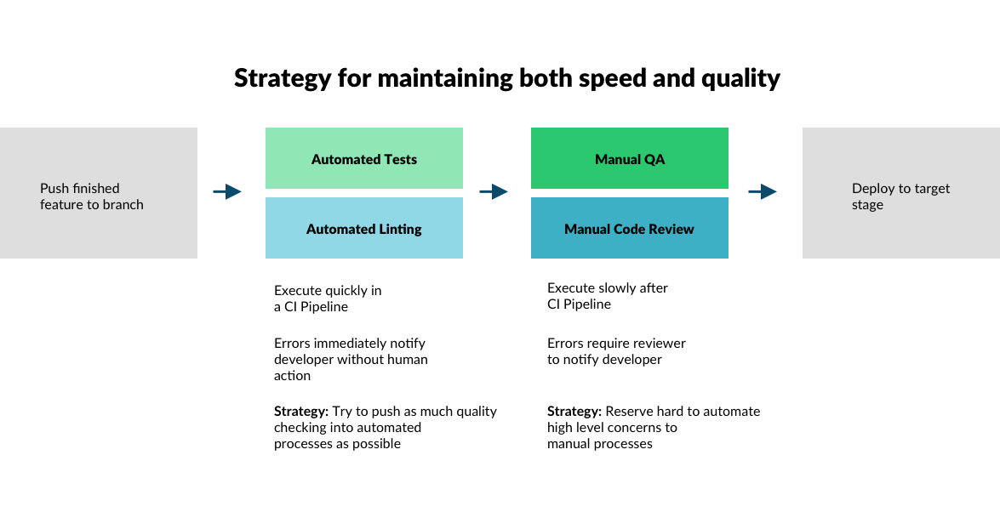

# ESlint Pattern

### Video Walkthroughs
- [1. Overview of Strategy to maintain speed and quality](https://www.loom.com/share/b8d4397895f8481dac738ce58afce4bf)
- [2. How ESLint works](https://www.loom.com/share/088243e225644553b0e59261964c97b4)
- [3. Strategies for implementing ESLint into an existing codebase](https://www.loom.com/share/7f8c8c5f187645238d14d4c509d2afb9)
- [4. How ESLint influences the Code Review Process](https://www.loom.com/share/393c4d1c1ba0419ebecd7af55b9c131a)

# Overall Strategy for maintaining both Speed and Quality


Recommendations:
To reduce the amount of work involved in code reviews and QA, we suggest using the following tools:
- Jest testing will validate functionality
- ESLint will validate code style standards

The QA team will manually check what is not automatically checked by our tests. The code reviewer will manually check what is not automatically checked by ESLint


# Code checks that should be automated with ESLint
ESLint rules should take into account the context, development team, and codebase they are being applied to. The purpose of these rules is to acheive readable, debuggable, testable code. Acheiving these goals may mean different things per context.

### Maximum Block Size
One important way to achieve readable, debuggable, testable code is to keep our functions small and flat. One way to acheive this is to set limits on how many lines a function can have (height) and how many times a function is allowed to indent (width). You can imagine, with these 2 rules, we are drawing a box around our functions and defining the maximum size:


We will refer to this idea as 'Maximum Block Size'. In the diagram above, we are determining that the maximum function line length is 14, and the maximum indentation depth is 4. These 2 rules which make up our Miximum Block Size are visualized as a green box above. The red line of code to the right of the green box is breaking the maximum depth rule of 4, since it is indented 5 times. The red lines of code below the green box are breaking our maximum function line rule of 14.

The goal here is not to reach an ideal function length or width, its to make our code more readable, debuggable, and testable. Enforcing ESLint rules is simply one concrete way to help us write readable code.

### Rules to define in ESLint
- For new code, is indentation at an acceptable maximum depth (as defined in ESLint)
- For new code, is function length an acceptable maximum length (as defined in ESLint)
- Prefer modern javascript syntax such as
    - const and let over var (as defined in ESLint)
- Are there an acceptable amount of nested callbacks? (as defined in maximum callbacks in ESLint)

All of the rules above will be automatically checked by ESLint, and will not require a manual check in a code review.

# Code checks manually performed by a code reviewer
### Serverless.yml checklist
- are we using `package:` to define what we are including in deployment
- Is the serverless.yml file valid (has it been tested by deploying to INT from developers machine)
- Do resources include variable stage names
- Do we have any hard coded resources that can be made dynamic with SLS pro outputs and params?
- If changes where made to the `serverless.yml` file, has the author of this PR validated it by deploying to their `dev` stage?

### The primary question of a code review
Does the code involved in this added feature / change / refactor make sense?
- if not, either
    - The code is good, but needs to documented
    - There are improvements that can be made

### General Code Review checklist
- If new code includes callbacks, do we have a good reason for it?
- Are names semantic and meaningful?
- Does the code consider failures? Messages, information, error handling
- Prefer modern javascript syntax such as async await over callbacks
- Should certain functionality be abstracted into a helper function for others to make use of?

### Documentation checklist
- Is there any complex code that requires documentation
- Is documentation on functions, methods, classes, contexts, and behaviours adequate?


### Testing Code Review checklist
- Test should be able to run in any order. To insure this, we must validate that tests do not rely on any state outside of the test
- Tests should only test 1 thing at a time
    - 'it works'
    - 'Test Case 1'
    - 'works based on data we give it'
- Tests should avoid more than 10 expect statements. This is a sign that it may be testing more than 1 thing. When testing an object with 5 properties, rather than write 5 expects with .toBe, write 1 expect with .toEqual. This allows you to confirm a full object is what you expect it to be with 1 expectatation.
- Unit Tests should be small and focused, and should not need lots of mocking. This depends a lot on the code you are testing. When tests are big and hard to mock, its a sign that the code is big and many types of code (business logic, IO) are mixed together. Big tests may be the only option until code is refactored.


# Resources
- [Available ESLint Rules](https://eslint.org/docs/rules/)
- [How CI fits into Code Reviews in Bitbucket](https://bitbucket.org/blog/level-up-your-code-review-with-continuous-integration)

# How to write code reviews

- [Code Review for Humans](https://phauer.com/2018/code-review-guidelines/)
- [Code Review Etiquette](https://css-tricks.com/code-review-etiquette/)
- [Pragmatic Code Reviews](https://www.freecodecamp.org/news/a-zen-manifesto-for-effective-code-reviews-e30b5c95204a/)


# Advice
- Give context by writing in the PR description an explanation of the current PR. Write the PR as if someone brand new to the team is assigned to review it on their first day. This imagined audience will help make the written description very clear.
- The smaller the PR, the better and more helful the feedback. (Example)[https://twitter.com/iamdevloper/status/397664295875805184?s=20]


# Recommended ESLint Default js file
```js
module.exports = {
    env: {
        commonjs: true,
        es6: true,
        node: true,
        jest: true
    },
    extends: 'eslint:recommended',
    globals: {
        Atomics: 'readonly',
        SharedArrayBuffer: 'readonly',
        fetch: false,
        process: true
    },
    parserOptions: {
        ecmaVersion: 2018
    },
    ignorePatterns: [
        "**/*.test.js",
        "node_modules/"
    ],
    rules: {
        'eqeqeq': 'warn',
        'no-useless-catch': 'warn',
        'no-eq-null': 'warn',
        'no-undef-init': 'warn',
        'no-unreachable': 'warn',
        'no-const-assign': 'error',
        'array-callback-return': 'warn',
        'max-lines': ['warn', {
            "max": 1000
        }],
        'no-loop-func': 'warn',
        'max-params': ["warn", 4],
        'no-unmodified-loop-condition': 'error',
        "no-global-assign": "warn",
        'prefer-const': 'warn',
        'no-unused-expressions': 'warn',
        'no-extra-semi': 'warn',
        'no-var': 'warn',
        'max-nested-callbacks': ["error", { "max": 5 }],
        'max-depth': ["warn", 4],
        "max-lines-per-function": ["warn", 200],
    }
}

```

# Recommended ESLint Default json file
JSON Version:
```
{
    "env": {
        "node": true,
        "commonjs": true,
        "es6": true,
        "jest": true
    },
    "extends": "eslint:recommended",
    "globals": {
        "Atomics": "readonly",
        "SharedArrayBuffer": "readonly",
        "fetch": false,
        "process": true
    },
    "parserOptions": {
        "ecmaVersion": 2018
    },
    "ignorePatterns": [
        "**/*.test.js",
        "node_modules/"
    ],
    "rules": {
        "eqeqeq": "warn",
        "no-useless-catch": "warn",
        "no-eq-null": "warn",
        "no-undef-init": "warn",
        "no-unreachable": "warn",
        "no-const-assign": "error",
        "array-callback-return": "warn",
        "max-lines": [
            "warn",
            {
                "max": 1000
            }
        ],
        "no-loop-func": "warn",
        "max-params": [
            "warn",
            4
        ],
        "no-unmodified-loop-condition": "error",
        "no-global-assign": "warn",
        "prefer-const": "warn",
        "no-unused-expressions": "warn",
        "no-extra-semi": "warn",
        "no-var": "warn",
        "max-nested-callbacks": [
            "error",
            {
                "max": 5
            }
        ],
        "max-depth": [
            "warn",
            4
        ],
        "max-lines-per-function": [
            "warn",
            200
        ]
    }
}
```


# Example Bitbucket pipeline config:
```yml
image: node:10.15.3

pipelines:
  branches:
    master:
      - step:
          caches:
            - node
          script:
            - npm install
            - npm run lint
            - npm run test-unit
            - npm run test-int
            - npm run test-e2e

  pull-requests:
    '**':
      - step:
          caches:
            - node
          script:
            - npm install
            - npm run lint
            - npm run test-unit
```

