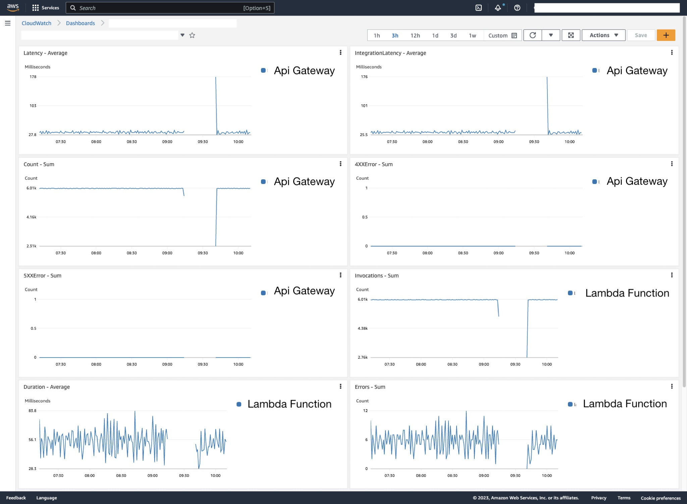

# AWS SAM with CloudWatch Dashboard for USE and RED metrics monitoring

Template for AWS SAM to deploy a CloudWatch Dashboard with a set of widgets to monitor the metrics of a Lambda function and API Gateway.

Following the USE and RED metrics monitoring methodology:

- **USE:** Utilization, Saturation, Errors, https://www.brendangregg.com/usemethod.html

- **RED:** Rate, Errors, Duration, https://www.slideshare.net/weaveworks/monitoring-microservices

## How it looks

