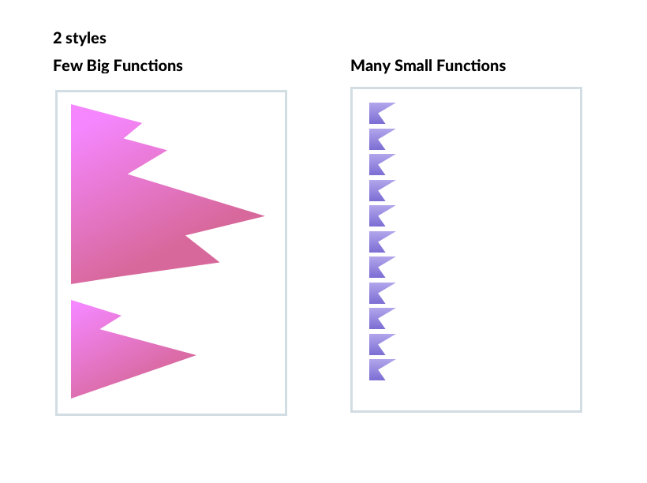
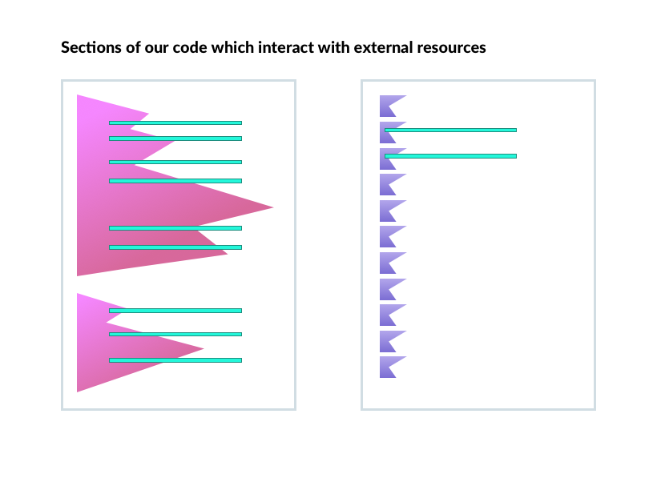
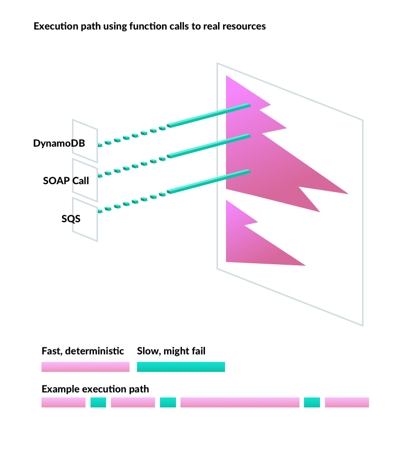

# Mocking

What affect does the size of our functions have on our ability to test our code?

If we look at the following function:
```js
const handler = async (user) => {
    let tripList = [];
    let loggedUser = userSession.getLoggedUser();
    let isFriend = false;
    if (loggedUser != null) {
        let friends = user.getFriends();
        for (let i=0; i < friends.length; i++) {
            let friend = friends[i];
            if (friend == loggedUser) {
                isFriend = true;
                break;
            }
        };
        if (isFriend) {
            tripList = tripDb.findTripsByUser(user)
        }   
        
        return addDaysLeft(tripList)
    } else {
        throw new Error('User not logged in.')
    }
}
```

It is 25 lines long and has a maximum indentation level of 4. This is managable and testable, but functions that are 500 lines long with 10 levels of indentation can be hard to manage. Often big functions with multiple callbacks develope a sideways 'mountain range'. An alternative to this is to make many small shallow functions. Because these functions are small, they usually do not have the oppurtunity to include many levels of indentation. Both types of functions are visualized below.



Which one should be preferred? One of the SOLID principles is the principle of [Single Responsibility](https://github.com/ryanmcdermott/clean-code-javascript#single-responsibility-principle-srp). Every function should have only one reason to change. If a function is doing multiple things, it should be broken up.

How does the size of a function affect testability? The size actually does not nessisarily make testing harder. What does make testing harder is the number of IO or external resources functions called within a function. The bigger the function, the easier it is to have many IO calls. Below is a diagram, the green lines indicate a function that is interacting with an external resource (database, event stream, external rest api).



In order to unit test a function that involves IO functions, we need to mock them so they do not actually call those external resources while testing.


 


Once we have all of our IO functions mocked, we have the ability to simulate many combination of success's, failures, alternative responses, and null responses from our external resources and confirm our code is handling each scenario properly.


