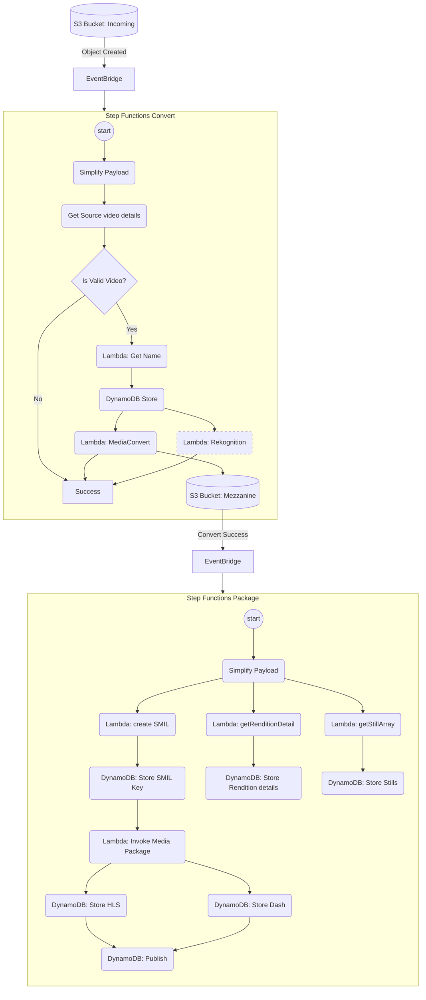

# Media Pipeline

https://aws.amazon.com/solutions/implementations/video-on-demand-on-aws/

Boilerplate template for [Serverless](https://serverless.com) allowing to easily separate each function into it's own dedicated file or folder.

The template is for [NodeJS 18.x](https://nodejs.org/) and it uses [esbuild plugin](https://github.com/floydspace/serverless-esbuild) to reduce each packaged function.

## Flow
* The pipeline is invoked when a new file is uploaded to the _Incoming Bucket_
* Using AWS MediaConvert, several sizes of the input file are created:
  * 270p
  * 360p
  * 480p
  * 720p (HD)
  * 1080p (FHD)
  * 2160p (4k)

  > Only smaller renditions that the input are created
* Using MediaPackage, this sizes are used to provide the content as _HLS_ and _Dash_



## Project creation
`sls create --template-url https://github.com/DanielMuller/serverless-template-aws-esbuild-nodejs/tree/master/ --path my-new-service --name awesome-service`

### Configuration
Create and edit *config/dev.yml* and *config/production.yml* to suit your needs.

Run `nvm use` to load the right node version and `npm install` to install all the dependencies.

## File structure
- **events/**
  Store all events related to testing
- **lib/config.js**
  Javascript module to build serverless.yml
- **resources/**
  Contains yml files describing each resource. Definitions can be nested 2 levels deep, in a subfolder describing the AWS resource, like `IamRole/specificServiceRole.yml`.
  The folder name is expected to follow [Serverless convention](https://serverless.com/framework/docs/providers/aws/guide/resources#aws-cloudformation-resource-reference) for naming.
- **services/**
  Contains each individual Lambda function (.js) and it's definitions (.yml).
  In addition to the usual *handler* and *event* definitions, the yml can also hold a specific *resource* definition related to the function, without the need for an entry in the *resources/* folder.
- **stages/**
  Stage specific configurations.

## Deploy
`sls deploy` (development) or `sls -s production deploy`

### ESBuild
ESBuild will automatically bundle only the used dependencies and create a unique and smaller bundle for each function.

## Logging
[lambda-log](https://www.npmjs.com/package/lambda-log) provides a more structured way of logging:
```javascript
import { LambdaLog } from 'lambda-log'
logger = new LambdaLog()
logger.info('Log Tag', {key1: value1, key2: value2})
```
Which will result in:
```
{"_logLevel":"info","msg":"Log Tag","key1":"value1","key2":"value2","_tags":["log","info"]}
```
You can also add meta data by default:
```javascript
logger.options.meta.fct = 'fctName'
logger.options.meta.requestId = event.requestContext.requestId
logger.options.meta.path = event.path
logger.options.meta.sourceIp = event.requestContext.identity.sourceIp
```
