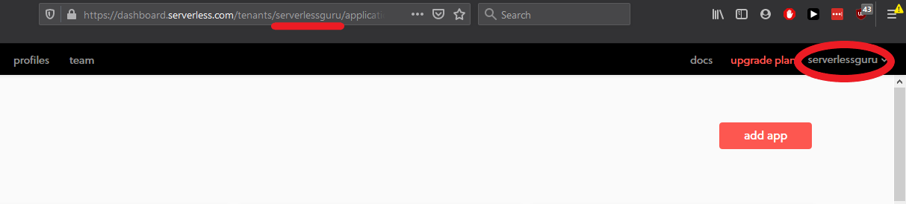
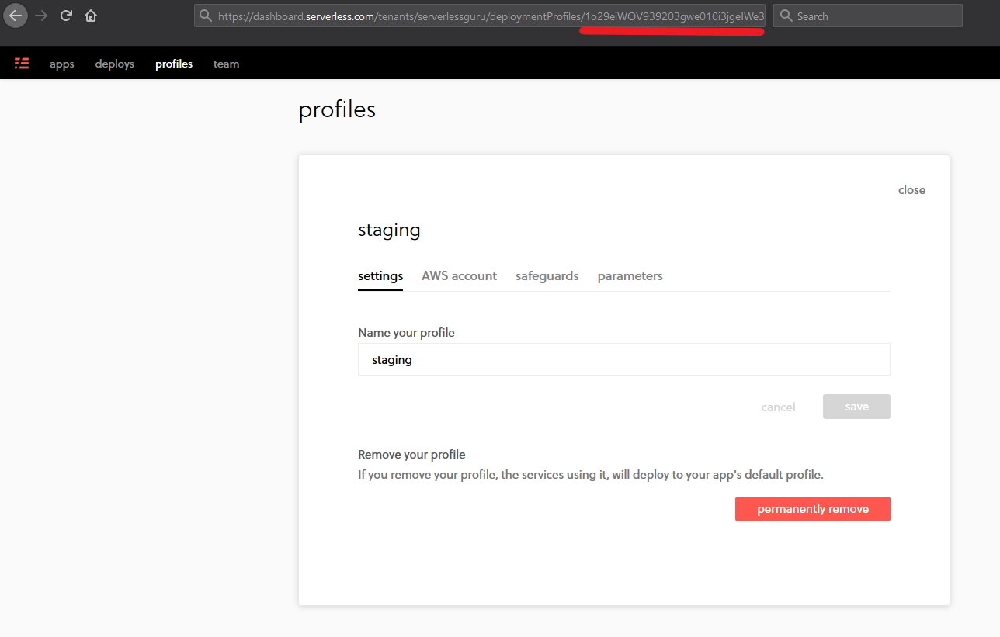
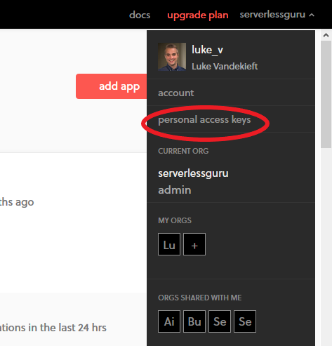
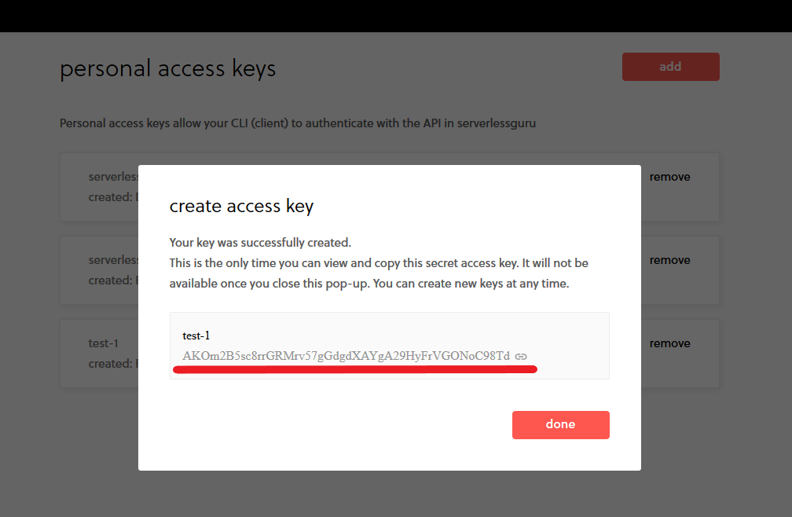

# SLS Pro Helper Scripts (By Serverless Guru)

* [Insert](#insert-params-into-sls-pro)

* [Copy](#copy-params-from-one-place-to-another)

* [Export](#export-params-from-sls-pro-locally)

* [Delete](#delete-all-params-from-profile)

## Insert Params into SLS Pro

WARNING: `.env.insert` file will update existing params, but won't delete anything

* [Overview](#insert-overview)

* [Env File Setup](#insert-env-file-setup)

* [Run](#insert-run)

### Insert: Overview

This tutorial explains how to insert params from a .env file into a Serverless Pro profile. The Serverless Dashboard allows for unlimited params on a profile so on larger projects copying each line item to a new profile can be prohibitive. This template creates a local node.js environment that takes your .env file, compares it to a new profile, and then pushes up a new list of combined params.

More information on parameters can be found in the [Serverless Documenation](https://serverless.com/framework/docs/dashboard/parameters/). 

### Insert: Env File Setup

#### 1. Add `SLS_ORG` to `.env` File

Your Serverless Dashboard organization can be found both in the top right corner and in the URL after `/tenants`:



This and all remaining variables will be added to the `.env` file like so:

```
SLS_ORG=serverlessguru
```

#### 2. Add `TARGET_PROFILE` to `.env` File

Follow the same process as step 1. You must have an existing profile to copy *to*, even if it's completely blank.



#### 3. Add `TOKEN` to `.env` File

Our upcoming Serverless SDK calls require a personal access key. If you already one one go ahead and use that as your token, otherwise you can create a new one by navigating to "personal access keys" in your organization's dropdown menu:



From there click "add", type in a name for your key, and click "create". Copy the shown value both to `.env` and to your own secure location as this value will not be shown again.



#### Final Result

This is an example of what your `.env` file may look like, notice the `INSERT_FROM_FILE` option, this isn't required if you do have it the script will pull from that file locally and update your params.

```
SLS_ORG=<>
TARGET_PROFILE=<>
TOKEN=<>
INSERT_FROM_FILE=./backup/<>.json
```

To generate a backup file, run:

```
npm run export
```

This will create the following:

```
backup/
  exportParams-profile_name-timestamp.json
```

Then update your `.env`:

```
INSERT_FROM_FILE=./backup/exportParams-profile_name-timestamp.json
```

And run:

```
npm run insertParams
```

### Insert: Run

#### 1. Install Serverless

```
$ npm install -g serverless
```

#### 2. Install Remaining Dependencies
```
$ npm install
```

#### 3. Run the insertParams Script:
```
$ node -e 'require("./index").insertParams()'
```

This will run the wrapper function that pulls the Target and Source profiles using `getParams`, joins their safeguards and params using `joinArrays` (ignoring any duplicates provided by the Source profile), and pushing the new values up using the `patchparams`. 

At this point your updates should be live!

---

## Copy params from one place to another

* [Overview](#copy-overview)

* [Env File Setup](#copy-env-file-setup)

* [Run](#copy-run)

### Copy: Overview

This tutorial explains how to duplicate params from one Serverless Pro profile to another. The Serverless Dashboard allows for unlimited params on a profile so on larger projects copying each line item to a new profile can be prohibitive. This template creates a local node.js environment that pulls an original profile, compares it to a new profile, and then pushes up a new list of combined params and safeguards.

More information on parameters can be found in the [Serverless Documenation](https://serverless.com/framework/docs/dashboard/parameters/). 

### Copy: Env File Setup

#### 1. Add `SLS_ORG` to `.env` File

Your Serverless Dashboard organization can be found both in the top right corner and in the URL after `/tenants`:


This and all remaining variables will be added to the `.env` file like so:

```
SLS_ORG=serverlessguru
```

#### 2. Add `FROM_PROFILE` to `.env` File

This is the ID of the Serverless profile you are looking to copy params *from*.

You can find this value by navigating to "Profiles" in the Serverless Dashboard and selecting the desired profile. Once there get the profile's ID from the URL:


#### 3. Add `TARGET_PROFILE` to `.env` File

Follow the same process as step 1. You must have an existing profile to copy *to*, even if it's completely blank.


#### 4. Add `TOKEN` to `.env` File

Our upcoming Serverless SDK calls require a personal access key. If you already one one go ahead and use that as your token, otherwise you can create a new one by navigating to "personal access keys" in your organization's dropdown menu:


From there click "add", type in a name for your key, and click "create". Copy the shown value both to `.env` and to your own secure location as this value will not be shown again.


### Copy: Run

#### 1. Install Serverless

```
$ npm install -g serverless
```

#### 2. Install Remaining Dependencies
```
$ npm install
```

#### 3. Run the copyParams Script:
```
$ node -e 'require("./index").copyParams()'
```

This will run the wrapper function that pulls the TARGET and SOURCE profiles using `getParams`, joins their safeguards and params using `joinArrays` (ignoring any duplicates provided by the SOURCE profile), and pushing the new values up using the `patchparams`.

At this point your updates should be live!


---

## Export params from SLS Pro locally

COMING SOON

## Delete all params from profile

COMING SOON