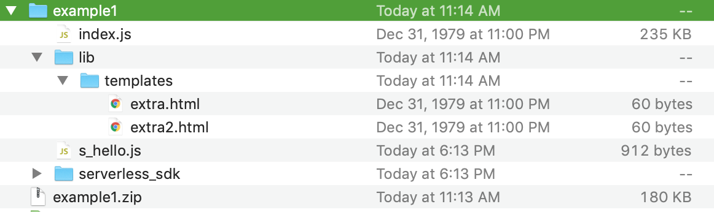

# Serverless Webpack - Example Project

## Purpose

Reduce the size of your lambda package sizes.

## Steps

### Install

```bash
npm i --save-dev serverless-webpack webpack copy-webpack-plugin
```

### Update serverless.yml file in plugins section

```yaml
provider:
    name: aws
    ...
plugins:
    - serverless-webpack
package:
    individually: true
```

### Create webpack.config.js file

```js
const slsw = require('serverless-webpack');
module.exports = {
  target: 'node',
  entry: slsw.lib.entries,
  mode: slsw.lib.webpack.isLocal ? 'development' : 'production',
  node: false,
  optimization: {
    minimize: false,
  },
  devtool: 'inline-cheap-module-source-map',
};
```

#### If you need to package other files in your lambda zip

```js
const slsw = require('serverless-webpack');
const CopyPlugin = require('copy-webpack-plugin');

module.exports = {
  target: 'node',
  entry: slsw.lib.entries,
  mode: slsw.lib.webpack.isLocal ? 'development' : 'production',
  node: false,
  optimization: {
    minimize: false,
  },
  devtool: 'inline-cheap-module-source-map',
  plugins: [
    new CopyPlugin({
      patterns: [
        'lib/templates/**'
      ]
    }),
  ],
};
```

This will package all the files or folders underneath the `lib/templates` directory using the glob or `**` pattern. Any additional paths can be added underneath the `patterns` array.

The two main sections added:

```js
const CopyPlugin = require('copy-webpack-plugin');
```

Importing the copy plugin and adding paths under `patterns` array:

```js
plugins: [
    new CopyPlugin({
      patterns: [
        'lib/templates/**'
      ]
    }),
],
```

The patterns section is what we use to specify our paths for webpack. These paths are what files to add with the zip file. Notice the usage of `**` this glob pattern will grab all files/folders under a directory.

#### Here is an example of the output of packaging with the copy plugin



### Package

```bash
sls package
```

### Review .zip file, it should be much smaller

### Additional Optimization, add package: individually: true

```yaml
provider:
    name: aws
    ...
package:
    individually: true
plugins:
    - serverless-webpack
```

## Warning

Trying to use `include/exclude` pattern will no longer work. You can't do this when using `serverless-webpack` plugin.

```yaml
package:
    include:
        - file
    exclude:
        - file
```

If you need to bundle any other files that `serverless-webpack` doesn't automatically pick up you will need to do that in the `webpack.config.js` file. Please review [this section](#If-you-need-to-package-other-files-in-your-lambda-zip) for how to do this.
